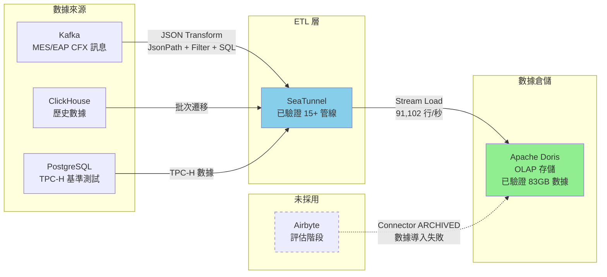

# Doris-SeaTunnel ETL POC

## 專案背景與目標

本專案為製造業數據中台的技術選型驗證專案，目標是評估並驗證以下技術組合在製造業數據整合場景中的可行性：

- **Apache Doris** 作為 OLAP 數據倉儲
- **Apache SeaTunnel** 作為 ETL 數據整合工具
- **Kafka** 作為即時數據流來源（MES/EAP 製造數據）

本專案已完成技術選型評估、部署驗證與數據流測試，並產出選型報告書。專案定位為技術驗證與參考實作，不作為生產環境使用。

---

## 問題定義與限制條件

### 實際面臨的技術問題

1. **數據匯流工具選擇**：需要評估開源 ETL 工具（SeaTunnel vs. Airbyte）在製造業場景的適用性
2. **OLAP 數據倉儲選擇**：需要驗證 Apache Doris 在大規模數據查詢與存儲的效能表現
3. **即時數據處理**：需要驗證從 Kafka 到 Doris 的即時數據管線穩定性
4. **數據結構保留**：製造業數據（如 CFX 訊息）包含複雜的嵌套結構（Array、Object），需要驗證 ETL 工具能否完整保留原始數據結構

### 專案邊界與前提條件

- **測試環境**：Delta Local VM（8 核 CPU、16GB RAM、100GB HDD）
- **數據來源**：Kafka（MES/EAP 訊息）、ClickHouse、PostgreSQL（TPC-H 基準測試）
- **測試規模**：已驗證處理 33GB+ 數據（8500 萬筆記錄）
- **部署方式**：Docker Compose 本地部署
- **不包含**：生產環境配置、高可用架構、監控告警系統、數據品質管理

---

## 技術選型與角色定位

### Apache Doris（數據倉儲）

**角色**：OLAP 數據倉儲，負責大規模數據存儲與即時查詢

**已驗證功能**：
- 數據模型：Unique Key Model、Duplicate Key Model
- 分區與分桶：動態分區（按月）、自動分桶機制
- 冷熱數據分層：Storage Policy 配置（S3 冷數據歸檔）
- Stream Load：已驗證 33GB 數據導入（吞吐量 91,102 行/秒）
- 錯誤捕獲：數據過長錯誤、數據質量錯誤、協議錯誤

**測試結果**：
- 成功處理 85,356,959 筆記錄（83.04 GB）
- 字節吞吐量：66.68 MB/秒
- 支援複雜 JSON 結構（Array、Object）
- 已知限制：單一欄位超過限制會導致 OOM（如 CFX.Production.UnitsArrived 的 MessageBody）

### Apache SeaTunnel（ETL 工具）

**角色**：數據整合工具，負責從多種數據來源提取、轉換並載入到 Doris

**已驗證功能**：
- **Source**：Kafka（SASL/PLAIN、PLAINTEXT）、ClickHouse、PostgreSQL
- **Transform**：JsonPath（JSON 結構解析）、Filter（數據過濾）、SQL（數據轉換）、TimestampFormat（時間格式轉換）
- **Sink**：Doris（支援 schema_save_mode、data_save_mode、save_mode_create_template）
- **執行模式**：Batch、Stream
- **效能**：已驗證處理 83.04 GB 數據（吞吐量 64.88 MB/秒、62,657 行/秒）

**測試結果**：
- 成功從 Kafka 消費並轉換 CFX 訊息（17 種 MessageName）
- 完整保留原始數據結構（與 Airbyte 相比）
- 支援複雜 Transform 組合（JsonPath + Filter + SQL）
- Kafka Topic 命名規則：預設以 `.` 分割為 `<database>.<table>`

### Airbyte（評估但未採用）

**角色**：替代 ETL 工具評估

**評估結果**：
- Doris Connector 已被官方 ARCHIVED，需自行建立 Custom Connector
- 測試案例：Kafka → Doris、PostgreSQL → Doris
- **問題**：連線成功但數據未成功導入
- **數據結構處理**：將原始數據壓縮成單一欄位，附加元數據（不符合需求）
- **結論**：不適合本專案需求，未繼續深入測試

---

## 選型評估與決策依據

### 評估維度

| 評估項目 | SeaTunnel | Airbyte |
|---------|-----------|---------|
| **數據結構保留** | ✅ 精確映射原始數據至目標欄位 | ❌ 數據結構簡化為單一欄位 |
| **數據轉換能力** | ✅ 豐富（JsonPath、Filter、SQL） | ⚠️ 基本（字段映射、類型轉換） |
| **吞吐量** | ✅ 高（數萬/秒） | ⚠️ 中（數千/秒） |
| **延遲** | ✅ 低 | ⚠️ 高 |
| **Doris 支援** | ✅ 原生支援 | ❌ Connector 已 ARCHIVED |
| **學習曲線** | ⚠️ 陡峭（CLI） | ✅ 簡單（UI） |
| **部署難度** | ⚠️ 有門檻（CLI） | ✅ 簡單（UI） |

### 明確取捨原因

**選擇 SeaTunnel 的原因**：
1. **數據結構完整性**：製造業數據（CFX 訊息）包含複雜嵌套結構，SeaTunnel 能完整保留，Airbyte 會壓縮為單一欄位
2. **效能需求**：SeaTunnel 吞吐量為 Airbyte 的 10-30 倍，適合大規模數據處理
3. **Doris 整合**：SeaTunnel 原生支援 Doris，Airbyte 的 Doris Connector 已被官方封存

**Airbyte 未採用原因**：
1. Doris Connector 已 ARCHIVED，需自行維護
2. 測試中數據導入失敗（連線成功但數據未寫入）
3. 數據結構處理不符合製造業需求

---

## 實際落地成果

### 已完成的部署與整合

1. **Doris 部署**：
   - FE/BE Docker 部署（版本 2.1.5）
   - 配置動態分區（按月）與自動分桶
   - 配置 Storage Policy（S3 冷數據歸檔）

2. **SeaTunnel 部署**：
   - Docker 部署（版本 2.3.7）
   - 配置 15+ ETL 管線（Kafka → Doris、ClickHouse → Doris）

3. **數據來源整合**：
   - Kafka（MES/EAP 製造數據）
   - PostgreSQL（TPC-H 基準測試）
   - ClickHouse（歷史數據）

### 已驗證的數據流程

1. **Kafka → Doris 即時管線**：
   - 成功處理 33GB CFX 訊息（33,206,750 筆記錄）
   - 吞吐量：91,102 行/秒、99,999,360 Bytes/秒
   - 支援 17 種 MessageName（如 CFX.ResourcePerformance.StationParametersModified、CFX.Heartbeat 等）

2. **PostgreSQL → Doris 批次管線**：
   - TPC-H 基準測試數據導入
   - 驗證 Doris OLAP 查詢效能

3. **ClickHouse → Doris 歷史數據遷移**：
   - 批次數據遷移驗證

### 效能測試結果

| 數據量 (GB) | 處理時間 (秒) | 總記錄數 | 吞吐量 (MB/秒) | 吞吐量 (行/秒) | 工具 |
|------------|-------------|---------|---------------|---------------|------|
| 0.26 | 11 | 1,000,000 | 24.64 | 90,909 | SeaTunnel |
| 6.99 | 149 | 27,434,992 | 48.06 | 184,899 | SeaTunnel |
| 21.47 | 486 | 85,286,028 | 45.27 | 175,483 | SeaTunnel |
| 83.04 | 1,363 | 85,356,959 | 64.88 | 62,657 | SeaTunnel |
| 33.68 | - | 33,206,750 | - | 91,102 | Doris Stream Load |

---

## Repository 內容說明

### 實際存在的檔案與用途

```
doris-seatunnel-etl-poc/
├── doc/                          # 選型報告書與技術文件
│   ├── 選型報告書-Doris.md        # Doris 評估報告（權威來源）
│   ├── 選型報告書-seatunnel.md    # SeaTunnel 評估報告（權威來源）
│   ├── 選型報告書-Airbyte.md      # Airbyte 評估報告（權威來源）
│   └── *.md                      # 其他技術筆記與問題記錄
│
├── doris/
│   ├── doris/
│   │   ├── docker-compose.yaml   # Doris FE/BE Docker 部署配置
│   │   ├── be/                   # Backend 配置
│   │   └── fe/                   # Frontend 配置
│   │
│   ├── seatunnel/
│   │   ├── EAP/                  # EAP 數據管線配置（15+ 個 .config 檔案）
│   │   ├── Kafka/                # Kafka 數據管線配置
│   │   └── *.cfg                 # SeaTunnel 管線配置（kafka_doris.cfg、clickhouse_doris.cfg 等）
│   │
│   ├── postgres/
│   │   ├── docker-compose.yaml   # PostgreSQL + pgAdmin Docker 配置
│   │   ├── scripts/              # TPC-H schema 初始化腳本
│   │   └── TPCH.tar.gz           # TPC-H 數據生成工具
│   │
│   └── kafka_RoutineLoad/        # Kafka Routine Load 測試配置
│
├── Postgresdb/
│   └── tpch2postgresdb.py        # TPC-H 數據載入 PostgreSQL 腳本
│
├── TPC-H V3.0.1/                 # TPC-H 基準測試工具
│   └── dbgen/                    # 數據生成工具
│
├── kafka/                        # Kafka 測試配置與問題記錄
│   ├── seatunnel_kafka_bug.txt
│   └── test_column.json
│
├── Airbyte/
│   ├── docker-compose.yml        # Airbyte 安裝指令（評估階段）
│   └── sameticlayer.py           # Semantic Layer 概念圖
│
└── README.md                     # 本檔案
```

### 各資料夾用途

- **doc/**：選型報告書（權威文件）與技術筆記
- **doris/doris/**：Doris FE/BE Docker 部署配置
- **doris/seatunnel/**：SeaTunnel ETL 管線配置（已驗證 15+ 個管線）
- **doris/postgres/**：PostgreSQL TPC-H 基準測試環境
- **Postgresdb/**：TPC-H 數據載入腳本
- **TPC-H V3.0.1/**：TPC-H 基準測試數據生成工具
- **kafka/**：Kafka 測試配置與問題記錄
- **Airbyte/**：Airbyte 評估階段檔案（未採用）

---

## 落地範圍與未涵蓋事項

### 明確未做、未包含的部分

1. **生產環境配置**：
   - 無高可用（HA）架構
   - 無負載均衡配置
   - 無災難恢復機制

2. **監控與告警**：
   - 無整合 Prometheus/Grafana
   - 無自動告警機制
   - 無效能監控儀表板

3. **數據品質管理**：
   - 無數據驗證規則
   - 無數據血緣追蹤
   - 無數據品質報告

4. **安全性**：
   - 無完整的權限管理（僅基本 RBAC）
   - 無數據加密（傳輸層與存儲層）
   - 無稽核日誌

5. **擴展性**：
   - 未驗證水平擴展能力
   - 未測試多節點部署
   - 未進行壓力測試

6. **Airbyte 整合**：
   - 評估階段發現問題後未繼續深入
   - 未完成 Doris Custom Connector 開發

### 為何未納入本次專案

- **專案定位**：技術選型驗證，非生產環境建置
- **資源限制**：測試環境為單機 VM，無法驗證分散式架構
- **時間限制**：專案目標為快速驗證技術可行性，非完整系統建置
- **範圍控制**：聚焦於核心技術選型（Doris vs. ClickHouse、SeaTunnel vs. Airbyte）

---

## 技術架構圖

以下為實際驗證的數據流架構（非概念圖）：



**說明**：
- 實線：已驗證並成功運行的數據流
- 虛線：評估但未採用的方案
- 綠色：數據倉儲層（已驗證 83GB 數據）
- 藍色：ETL 層（已驗證 15+ 管線）

---

## Repository Status

**狀態：已封存 / 技術參考**

- 本專案為技術選型驗證專案，已完成評估目標
- 不進行持續維護與功能擴充
- Issues 與 Pull Requests 不會被處理
- 建議作為技術選型參考，而非直接使用

---

## License

MIT License - 詳見 [LICENSE](LICENSE) 檔案

---

## Notes

### 關於大型檔案
- 大型二進位檔案（`*.tar.gz`、`*.zip`）已透過 `.gitignore` 排除
- 這些檔案保留在本地，但不上傳到 GitHub
- 建議從官方來源重新下載（Apache Doris、TPC-H）

### 關於敏感資訊
本 repository 已完成安全處理：
- ✅ 已替換所有 Kafka 帳號密碼為 `<KAFKA_USERNAME>` / `<KAFKA_PASSWORD>`
- ✅ 已替換所有 PostgreSQL 帳號密碼為 `<username>` / `<password>`
- ✅ 已替換所有內部 IP 位址為佔位符（`<kafka-broker>`、`<doris-fe-host>` 等）
- ✅ 已移除 GitLab 內部 URL

### 關於選型報告書
本 repository 的核心價值為三份選型報告書（位於 `doc/` 資料夾）：
- `選型報告書-Doris.md`：Doris 評估報告（數據模型、效能測試、錯誤處理）
- `選型報告書-seatunnel.md`：SeaTunnel 評估報告（Source/Transform/Sink 測試）
- `選型報告書-Airbyte.md`：Airbyte 評估報告（評估結果與未採用原因）

這些報告書為本專案的權威文件，README 內容均基於這些報告書撰寫。


