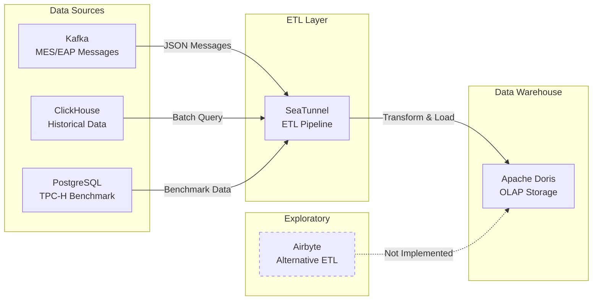

# MFG_DP (Manufacturing Data Platform POC)

## What is this

這是一個過去完成的製造業數據平台 POC（Proof of Concept）專案，用於驗證以下技術架構的可行性：
- Apache Doris 作為 OLAP 資料倉儲
- Apache SeaTunnel 作為 ETL 工具
- Kafka 作為即時資料串流來源
- 整合 MES（製造執行系統）與 EAP（設備自動化程式）資料

本專案僅供參考與存檔用途。

## What this is NOT

- 這不是一個持續維護的專案
- 這不是一個生產環境可用的系統
- 這不是一個具有長期支援的可重用工具或函式庫
- 這不包含完整的監控、容錯或擴展機制

## Background / Motivation

原始的專案背景與動機已不完全記得。

根據目前的程式碼與配置檔案，這個專案應該是為了評估特定技術堆疊在製造業數據整合場景中的適用性，包括：
- 驗證 Doris 的 OLAP 查詢效能（使用 TPC-H 基準測試）
- 測試 SeaTunnel 從多種資料來源（Kafka、ClickHouse、PostgreSQL）到 Doris 的資料管線
- 探索 Airbyte 作為替代 ETL 工具的可能性

專案代號為 `MFG_DP`，從 WBS 檔案推測這是企業內部數據中台的技術驗證階段。

## Repository Structure Overview

```
.
├── Airbyte/              # Airbyte ETL 工具探索（僅安裝指令與概念圖）
├── doris/                # Apache Doris 相關配置與資料管線
│   ├── doris/            # Doris FE/BE Docker 部署配置
│   ├── postgres/         # PostgreSQL Docker 環境與 TPC-H schema
│   ├── seatunnel/        # SeaTunnel ETL 管線配置檔案
│   └── kafka_RoutineLoad/# Kafka Routine Load 相關
├── doris_resource_tar/   # Doris 二進位檔案
├── kafka/                # Kafka 相關配置與測試資料
├── POC/                  # POC 相關資料（空）
├── Postgresdb/           # PostgreSQL TPC-H 資料載入腳本
└── TPC-H V3.0.1/         # TPC-H 基準測試資料生成工具
```

詳細資料夾說明請見下方 "Repository Structure / Folder Responsibility Mapping"。

## Scope

本專案涵蓋：
- Apache Doris FE/BE 的 Docker 部署配置
- SeaTunnel ETL 管線配置（Kafka → Doris、ClickHouse → Doris）
- MES/EAP 製造資料的 Kafka 訊息處理與轉換
- TPC-H 基準測試的 PostgreSQL schema 建立與資料載入
- 資料語意層（Semantic Layer）概念圖繪製

不包含：
- 生產環境部署配置
- 監控與告警機制
- 資料品質驗證
- 效能調校與最佳化
- 完整的錯誤處理與重試機制
- 持續維護與功能擴充

## Tech Stack

### 語言
- Python 3.x
- SQL

### 資料庫與儲存
- Apache Doris 2.1.5 (OLAP)
- PostgreSQL 13
- ClickHouse (作為資料來源)

### 資料整合
- Apache SeaTunnel 2.3.5 (ETL)
- Apache Kafka (訊息佇列)
- Airbyte (探索階段，未完整實作)

### 基礎設施
- Docker & Docker Compose

### Python 函式庫
- psycopg2 (PostgreSQL 連接)
- matplotlib (視覺化)

### 測試工具
- TPC-H V3.0.1 (基準測試)

## Conceptual Architecture

以下為概念性架構圖，僅供參考，不代表實際部署架構：



**注意：此圖為概念性示意圖（Conceptual diagram for reference only），不包含實際的網路拓撲、HA 配置或擴展機制。**

## Repository Structure / Folder Responsibility Mapping

```
project-root/
├── Airbyte/
│   ├── docker-compose.yml        # Airbyte 安裝指令（非標準 docker-compose 格式）
│   └── sameticlayer.py           # Metric Store vs Semantic Layer 概念圖繪製腳本
│
├── doris/
│   ├── doris/
│   │   ├── be/                   # Doris Backend 配置與腳本
│   │   ├── fe/                   # Doris Frontend 配置
│   │   ├── s3/                   # S3 相關配置
│   │   ├── docker-compose.yaml   # Doris FE/BE Docker 部署配置
│   │   └── kevin_docker-compose.yaml  # 替代 Docker 配置
│   │
│   ├── postgres/
│   │   ├── scripts/              # PostgreSQL 初始化腳本（TPC-H schema）
│   │   ├── docker-compose.yaml   # PostgreSQL + pgAdmin Docker 配置
│   │   ├── Dockerfile            # 自訂 PostgreSQL 映像檔
│   │   └── TPCH.tar.gz           # TPC-H 資料生成工具壓縮檔
│   │
│   ├── seatunnel/
│   │   ├── EAP/                  # EAP（設備自動化）資料管線配置
│   │   ├── Kafka/                # Kafka 相關配置
│   │   ├── *.cfg                 # SeaTunnel 管線配置檔案
│   │   └── dockercompose.yml     # SeaTunnel Docker 部署配置
│   │
│   ├── kafka_RoutineLoad/        # Kafka Routine Load 相關配置
│   ├── data.csv                  # 測試資料
│   ├── pk_message.csv            # PK 訊息測試資料
│   ├── streamload_example.csv    # Stream Load 範例資料
│   ├── streamload_example.xlsx   # Stream Load 範例資料（Excel）
│   ├── doris.tar                 # Doris 打包檔案
│   ├── doris.zip                 # Doris 打包檔案
│   └── README.md                 # GitLab 預設 README（未自訂）
│
├── doris_resource_tar/
│   └── apache-doris-2.0.12-bin-x64.tar.gz  # Doris 二進位發行版
│
├── kafka/
│   ├── seatunnel_kafka_bug.txt           # SeaTunnel Kafka 問題記錄
│   ├── seatunnel_kafka_sqltrans.txt      # SeaTunnel Kafka SQL 轉換記錄
│   ├── seatunnel_kafka_wj_config.txt     # SeaTunnel Kafka 配置記錄
│   └── test_column.json                  # 測試欄位定義
│
├── POC/                          # POC 相關資料（空資料夾）
│
├── Postgresdb/
│   ├── postgres/                 # PostgreSQL 相關檔案
│   ├── postgres_venv/            # Python 虛擬環境
│   ├── tpch2postgresdb.py        # TPC-H 資料載入 PostgreSQL 腳本
│   └── README.md                 # GitLab 預設 README（未自訂）
│
├── TPC-H V3.0.1/
│   ├── dbgen/                    # TPC-H 資料生成工具
│   ├── dev-tools/                # 開發工具
│   ├── ref_data/                 # 參考資料
│   ├── EULA.txt                  # 授權條款
│   ├── specification.docx        # TPC-H 規格文件
│   └── specification.pdf         # TPC-H 規格文件
│
├── wbs.xlsx                      # 工作分解結構（WBS）
├── 數據中台POC1_WBS.xlsx         # 數據中台 POC 工作分解結構
└── README.md                     # 本檔案
```

## Repository Status

**狀態：已封存 / 歷史參考**

本專案不再進行主動維護。
Issues 與 Pull Requests 可能不會被處理。

## License

本專案採用 MIT License - 詳見 [LICENSE](LICENSE) 檔案。

## Notes

本專案以現狀（as-is）分享。

建議將其視為歷史參考或教育用途，而非可直接使用的解決方案。

**關於大型檔案：**
- 大型二進位檔案（如 `doris_resource_tar/`, `*.tar`, `*.zip`）已透過 `.gitignore` 排除，不會上傳到 GitHub
- 這些檔案可在本地保留使用，但建議從官方來源重新下載

**上架前已處理的安全事項：**
- ✅ 已移除或遮蔽所有硬編碼密碼
- ✅ 已替換所有內部 IP 位址為佔位符
- ✅ 已移除內部 GitLab URL
- ✅ 已將大型檔案加入 .gitignore
