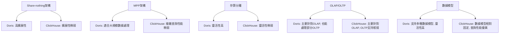

# Apache Doris vs. ClickHouse

----

[TOC]

----
* 補
1. 傳統式資料庫與MPP架構差異
2. 存算分離架構
3. POC上架測試內容比較

----

##  1. 簡介與背景  
###  Apache Doris vs. ClickHouse？  
- 這兩者都是流行的數據庫方案，但適用場景不同。  
- 需要根據數據分析需求選擇適合的技術。  

### 這兩者在數據解決方案中的定位  
- **Apache Doris**：適合 **BI 報表、多維分析**，兼容 MySQL。  
- **ClickHouse**：適合 **高頻查詢、流式數據分析**，極速查詢性能。  

### 專案背景 & 需求概述  
- 本次數據 pipeline 的目標：**高效處理與分析大規模數據**  
- 考慮 Apache Doris 和 ClickHouse 作為 OLAP 數據庫  

 **目標**：核心問題與目標。  

---
##  2.  MPP DB / In-Memory DB    
### MPP（Massively Parallel Processing）架構  
- **Apache Doris 屬於 MPP OLAP 數據庫**  
- 特點：
  - **分佈式存儲**  
  - **高併發處理**  
  - **多節點協同查詢**  

### In-Memory DB（內存數據庫）概念  
- **ClickHouse 屬於 列存 In-Memory 優化數據庫**  
- 特點：
  - **極速查詢**  
  - **高效壓縮**  
  - **適合即時分析**  

| 類別       | Apache Doris                 | ClickHouse                 |
|------------|-----------------------------|----------------------------|
| **架構**   | MPP 架構（FE+BE）            | Shared-Nothing 無共用      |
| **存儲方式** | 列式存儲（支持 Iceberg/HDFS） | 列式存儲（MergeTree）      |
| **內存使用** | 內存+磁碟（查詢時 MPP 計算） | 內存+磁碟（查詢時 In-Memory 優化） |
| **適合場景** | BI 報表、多維分析           | 高頻查詢、實時分析         |

 **目標**：讓聽眾清楚這兩種數據庫的基本概念，為後續對比做鋪墊。  

---

##  3. Apache Doris 與 ClickHouse 深度比較  

### 📊 Doris vs. ClickHouse 技術比較  

| 比較項目       | Apache Doris | ClickHouse |
|---------------|-------------|------------|
| **架構**      | MPP 架構（FE/BE） | Shared-nothing + 內存計算 |
| **數據存儲**  | Unique/Aggregate Key | MergeTree 家族 |
| **查詢加速**  | 索引 + MPP 計算 | 物化視圖 + 索引 |
| **數據導入**  | Stream Load / Broker Load | Kafka Engine / HTTP Insert |
| **SQL 標準**  | 更貼近標準 SQL | 需要部分自定義 SQL |
| **適用場景**  | BI 報表、企業級數據倉庫 | 高頻數據分析、監控日誌 |

###  Doris 的 FE/BE 架構 vs. ClickHouse 的 Shared-nothing  
- **Doris** 採用 **FE（Frontend）+ BE（Backend）**，前端管理，後端計算。  
- **ClickHouse** 採用 **Shared-Nothing**，所有節點獨立計算。  

###  存儲模型比較  
- **Doris**：Unique Key / Aggregate Key，適合 **多維數據分析**。  
- **ClickHouse**：MergeTree 家族，適合 **流式數據、時序數據**。  

###  Partition（分區）與 Bucket（分桶）比較  

| 特性            | Apache Doris | ClickHouse |
|---------------|-------------|------------|
| **Partition（分區）** | ✅ 支援 **範圍分區（Range Partition）**，可基於時間等維度劃分數據，提高查詢效率 | ✅ **支持 PARTITION BY**，但主要用於分片存儲，與 MergeTree 配合 |
| **Bucket（分桶）** | ✅ **支持 Bucketing（分桶）**，透過 **哈希分桶（Bucket by Hash）**，提高 Join 和 GroupBy 查詢效率 | ⚠️ **無內建分桶概念**，但可以透過 `SAMPLE BY`、`ORDER BY` 或 `PRIMARY KEY` 達到類似效果 |
| **數據分布** | **Partition + Bucket** 組合使用，可加速 **範圍查詢 + 分佈式計算** | **分片（Shard）+ 副本（Replica）**，主要依賴 MergeTree 引擎的存儲結構 |
| **適用場景** | 適合 **大規模 OLAP 數據倉庫**，查詢時減少掃描範圍 | 適合 **高頻查詢、流式數據**，以 MergeTree 高效索引和壓縮 |

###  Doris 與 ClickHouse 的 Partition/Bucket 設計核心差異 

1. **Doris 更接近傳統數據倉庫**，**強調 Partition（範圍分區）+ Bucket（哈希分桶）**，在 **多維分析、數據倉庫場景** 下更有優勢。  
2. **ClickHouse 的 Shared-Nothing 架構** 更側重於 **MergeTree 的索引優化**，不強制分桶，主要透過 **分片（Shard）+ 副本（Replica）+ 主鍵索引（PRIMARY KEY）** 來提升查詢性能。  

**如果是 OLAP 數據倉庫場景，Doris 的分區+分桶設計更強大**，而 **ClickHouse 則在流式數據和高頻查詢場景中更靈活**。

###  SQL 支援性  
- **Doris** 兼容 **MySQL**，SQL 更標準化。  
- **ClickHouse** 需要部分 **自定義 SQL**（如 ARRAY JOIN、TTL）。  

###  數據導入與導出  
- **Doris**：
  - **Stream Load** 適合大批量導入。  
  - **Kafka 整合比 ClickHouse 簡單**。  
- **ClickHouse**：
  - **Kafka Engine** 提供原生流式數據支持。  

 **目標**：清楚展示技術細節對比，幫助聽眾理解。  

---

##  4. 冷熱存儲比較：ClickHouse vs. Doris  

| 比較項目       | Apache Doris | ClickHouse |
|---------------|-------------|------------|
| **熱存儲**    | BE 節點內存 + SSD 存儲 | 主要基於列式存儲，內存計算優化 |
| **冷存儲**    | S3 / HDFS 兼容 | 支持 S3 / HDFS，提供 TTL 機制 |
| **存儲壓縮**  | LZ4 / ZSTD 支持 | LZ4 / ZSTD / Delta |
| **查詢性能**  | 針對 BI 優化，可做預聚合 | 針對即時查詢優化 |
| **自動分層**  | 支持數據生命周期管理（Lifecycle）| 依賴 MergeTree + TTL 控制冷熱數據 |

 **重點分析**：
- **Doris** 的 **冷數據可儲存在 HDFS / S3**。  
- **ClickHouse** 則 **依靠 MergeTree + TTL** 來管理冷熱數據，支持 HDFS / S3。  

 **目標**：說明兩者如何處理冷熱存儲，幫助選擇合適的方案。  

---
##  5. 實戰經驗與選擇時機  

###  何時選擇 **Apache Doris**？  
*  **BI 報表系統**，支撐企業級業務分析  
*  **高併發需求場景**（如大規模 Dashboard 查詢）  
*  **需要標準 SQL**，降低開發門檻  

###  何時選擇 **ClickHouse**？  
*  **高頻即時數據分析**，如監控、日誌數據  
*  **要求極速查詢**，秒級返回結果  
*  **容忍非標準 SQL**，能適應 ClickHouse 特殊語法  

*  **目標**：分享實際案例，提供決策依據。  

---

##  6. 我在專案中的觀察與個人看法  

 **Doris 與 ClickHouse 各自的優勢**  
- **Doris** 適合 **OLAP 數據倉庫**，特別是 **多維度查詢**。  
- **ClickHouse** 適合 **高頻查詢與即時流式分析**。  

 **在數據解決方案中的定位？**  
- **Doris**：作為 **核心數據倉庫**，支撐企業報表。  
- **ClickHouse**：作為 **邊緣計算層**，提供極速 OLAP 查詢。  
- **混合架構**：
  - **Doris 儲存歷史數據**，適合大數據存儲與查詢。  
  - **ClickHouse 提供實時查詢**，適合秒級響應需求。  

 **目標**：分享個人觀察，讓聽眾理解這兩者如何互補。  

---

##  7. 總結 & Q&A  

✔ **Apache Doris** 適合 **BI 報表、多維度數據分析**。  
✔ **ClickHouse** 適合 **流式數據、高速查詢**。  
✔ **選擇技術時，應根據需求場景，而非單看技術優勢**。  
✔ **實戰經驗**：Doris & ClickHouse 的應用場景與優勢互補。  

 **Q&A 時間

**Greenplum vs. ClickHouse vs. Apache Doris: Key Differences**

| **Feature** | **Greenplum** | **ClickHouse** | **Apache Doris** |
|---|---|---|---|
| **Architecture** | PostgreSQL-based MPP, complex queries & transactions | Shared-nothing distributed, high-performance OLAP | MPP architecture, real-time analytics & reporting |
| **Performance** | Strong for complex queries, potential bottlenecks in high concurrency | Extremely fast for large datasets, 100-1000x faster than traditional methods | High-performance, optimized for real-time analytics and reporting |
| **Data Storage** | Row-oriented, frequent writes & updates | Column-oriented, high compression, read-heavy analytics | Column-oriented, high compression, suitable for both batch and real-time data |
| **Scalability** | Limited horizontal scaling, data redistribution required | Linear scaling, dynamic runtime expansion | Highly scalable, supports both horizontal and vertical scaling |
| **Use Cases** | Traditional data warehousing, complex transaction processing (finance, telecom) | Real-time analytics, log analysis, ad networks, e-commerce, risk management | Real-time dashboards, ad-hoc queries, reporting, data warehousing |

**Apache Doris 補充說明：**

* Apache Doris 是一個現代化的 MPP 分析型資料庫，以其極致的速度和易用性而聞名。
* 它能夠很好地滿足報表分析、即席查詢、資料湖聯邦查詢加速等使用場景。
* Apache Doris 採用列式儲存，按列進行資料的編碼壓縮和讀取，能夠實現極高的壓縮比，同時減少大量非相關資料的掃描，從而更加有效利用 IO 和 CPU 資源。
* Apache Doris 具有高度的擴充性，能夠支援水平和垂直擴充。
* 它能夠很好的支援高並發的查詢場景。

**Greenplum vs. ClickHouse vs. Doris: Key Differences**

| Feature | Greenplum | ClickHouse | Doris |
|---|---|---|---|
| Architecture | MPP (PostgreSQL) | Shared-Nothing OLAP | MPP (Real-time) |
| Performance | Complex Queries | Fast Large Datasets | Fast Real-time |
| Storage | Row-oriented | Column-oriented | Column-oriented |
| Scalability | Limited | Linear | Highly Scalable |
| Use Cases | Data Warehouse, Transactions | Real-time Analytics, Logs | Dashboards, Reporting |

| Comparison Dimension | ClickHouse | Apache Doris |
|----------------------|------------|--------------|
| **Basic Architecture** | Single storage engine architecture | FE/BE separation architecture |
| **Data Organization** | Partition + Sparse index | Partition + Bucket + Prefix index |
| **Update Capability** | Primarily append-only, updates require workarounds | Supports row-level updates and deletions (UNIQUE model) |
| **Storage Model Types** | Single MergeTree model evolution | Three models (DUPLICATE/UNIQUE/AGGREGATE) |
| **Aggregation Processing** | Aggregation during query | Supports pre-aggregation (AGGREGATE model) |
| **Consistency** | Eventually consistent | Supports strong consistency replication |